# Qwen2-1.5B Fine-Tuning Project - Detailed Flow

## Project Overview
This project fine-tunes a Qwen2-1.5B language model using **LoRA (Low-Rank Adaptation)** for efficient parameter updates on CPU, then evaluates output quality and provides an interactive chat interface.

---

## Complete Flow Chart

```mermaid
graph TD
    Start([Start: User Initiates Training]) --> ConfigFile[Load config.yml]
    
    ConfigFile --> ModelLoad[Load Qwen/Qwen2-1.5B Model<br/>- AutoModelForCausalLM<br/>- AutoTokenizer<br/>- dtype: float32<br/>- trust_remote_code: true]
    
    ModelLoad --> LoRASetup[Setup LoRA Configuration<br/>- r: 64 rank<br/>- alpha: 16<br/>- dropout: 0.05<br/>- targets: q_proj, v_proj]
    
    LoRASetup --> PEFTModel[Apply LoRA with get_peft_model<br/>- Freezes base model<br/>- Adds trainable adapters<br/>- ~0.56% params trainable]
    
    PEFTModel --> DataLoad[Load Training Data<br/>- train.jsonl 3 samples<br/>- Format: User/Assistant pairs]
    
    DataLoad --> Tokenize[Tokenize Dataset<br/>- max_length: 512<br/>- padding: max_length<br/>- truncation: true<br/>- Creates input_ids & labels]
    
    Tokenize --> TrainArgs[Create TrainingArguments<br/>- batch_size: 1<br/>- gradient_accumulation: 4<br/>- learning_rate: 2e-4<br/>- epochs: 3<br/>- CPU training]
    
    TrainArgs --> Trainer[Initialize Hugging Face Trainer<br/>- Model + LoRA adapters<br/>- Training dataset<br/>- Tokenizer<br/>- Arguments]
    
    Trainer --> Training[Execute Training Loop<br/>- Forward pass<br/>- Loss calculation<br/>- Backward pass<br/>- Optimizer step<br/>- Save checkpoints]
    
    Training --> SaveModel[Save Fine-tuned Model<br/>- Output: ./qwen_finetune/<br/>- Includes LoRA adapters<br/>- Tokenizer config]
    
    SaveModel --> Decision{What to do next?}
    
    Decision -->|Evaluate| EvalLoad[Load test.jsonl<br/>- 5 samples with labels<br/>- Format: input + label]
    
    EvalLoad --> EvalRun[evaluation.py Process<br/>- Load fine-tuned model<br/>- Generate responses<br/>- Check output quality]
    
    EvalRun --> QualityCheck{Evaluate Response Quality}
    
    QualityCheck --> MetricsCalc[Calculate Metrics<br/>- Accuracy<br/>- Precision<br/>- Recall<br/>- F1 Score<br/>- Confusion Matrix]
    
    MetricsCalc --> PrintMetrics[Display Results<br/>- Total samples<br/>- Performance scores<br/>- Prediction breakdown]
    
    Decision -->|Chat| ChatLoad[chat.py: Load Model<br/>- From ./qwen_finetune/<br/>- Load tokenizer<br/>- Set to eval mode]
    
    ChatLoad --> ChatMode{Interaction Mode?}
    
    ChatMode -->|Interactive| ChatLoop[Start Chat Loop<br/>- Read user input<br/>- Generate response<br/>- Display output<br/>- Repeat until 'quit']
    
    ChatMode -->|Single| SinglePrompt[Process Single Prompt<br/>- Generate once<br/>- Return response]
    
    ChatLoop --> Generate[Model.generate<br/>- max_new_tokens: 100<br/>- temperature: 0.7<br/>- Decode output]
    
    SinglePrompt --> Generate
    
    Generate --> Display[Display Response to User]
    
    Decision -->|Re-train| ConfigFile
    
    PrintMetrics --> End([End])
    Display --> End
    
    style Start fill:#e1f5e1
    style End fill:#ffe1e1
    style Training fill:#fff4e1
    style SaveModel fill:#e1f0ff
    style MetricsCalc fill:#f0e1ff
    style Generate fill:#ffe1f0
```



---

## Detailed Component Flow

### **1. Configuration Phase** (`config.yml`)
```
┌─────────────────────────────────────┐
│  config.yml Settings                │
├─────────────────────────────────────┤
│ Model: Qwen/Qwen2-1.5B             │
│ Precision: float32 (CPU compatible) │
│ LoRA rank: 64, alpha: 16           │
│ Dataset: train.jsonl (3 samples)   │
│ Batch size: 1, Grad accum: 4       │
│ Learning rate: 2e-4, Epochs: 3     │
│ Output: ./qwen_finetune/           │
└─────────────────────────────────────┘
```

### **2. Training Phase** (`train_with_config.py`)

**Step-by-Step Process:**

1. **Load Configuration**
   - Read `config.yml` using PyYAML
   - Parse model, LoRA, dataset, training parameters

2. **Setup Logging**
   - Configure log level (INFO)
   - Create log file: `training.log`
   - Set up console + file handlers

3. **Load Model & Tokenizer**
   ```
   AutoTokenizer.from_pretrained("Qwen/Qwen2-1.5B")
   ├─> Set pad_token = eos_token
   
   AutoModelForCausalLM.from_pretrained()
   ├─> dtype: torch.float32
   ├─> low_cpu_mem_usage: true
   └─> ~1.5B parameters loaded
   ```

4. **Apply LoRA**
   ```
   LoraConfig(r=64, alpha=16, dropout=0.05)
   ├─> Target: q_proj, v_proj (attention layers)
   ├─> Freeze base model (99.44%)
   └─> Add trainable adapters (~8.7M params, 0.56%)
   ```

5. **Prepare Dataset**
   ```
   load_dataset("json", "train.jsonl")
   ├─> 3 samples (User/Assistant format)
   
   tokenize_function()
   ├─> Truncate to 512 tokens
   ├─> Pad to max_length
   ├─> Create input_ids
   └─> Create labels (same as input_ids)
   ```

6. **Training Arguments**
   ```
   TrainingArguments
   ├─> Effective batch: 1 × 4 = 4
   ├─> Learning rate: 2e-4
   ├─> Optimizer: AdamW
   ├─> LR scheduler: cosine
   ├─> Save every 500 steps
   └─> Log every 10 steps
   ```

7. **Execute Training**
   ```
   Trainer.train()
   ├─> Loop: 3 epochs
   │   ├─> Forward pass
   │   ├─> Calculate loss
   │   ├─> Backward pass
   │   ├─> Accumulate gradients (4 steps)
   │   ├─> Optimizer step
   │   └─> Log metrics
   │
   └─> Save final model to ./qwen_finetune/
   ```

### **3. Evaluation Phase** (`evaluation.py`)

**Flow:**
```
Load fine-tuned model from ./qwen_finetune/
↓
Load test.jsonl (5 samples)
↓
For each sample:
  ├─> Tokenize input
  ├─> Generate response (max_new_tokens=100)
  ├─> Extract generated text
  ├─> Evaluate quality:
  │   ├─> Check length (>5 chars)
  │   ├─> Check coherence (>2 words)
  │   └─> Check content (alphanumeric)
  ├─> Predict: "ok" or "not ok"
  └─> Compare with true label
↓
Calculate metrics:
  ├─> Accuracy = correct / total
  ├─> Precision = TP / (TP + FP)
  ├─> Recall = TP / (TP + FN)
  ├─> F1 = 2 × (P × R) / (P + R)
  └─> Confusion matrix
↓
Print results
```

### **4. Chat Interface** (`chat.py`)

**Flow:**
```
Load model from ./qwen_finetune/
↓
Two modes:
├─> Interactive:
│   └─> Loop:
│       ├─> Get user input
│       ├─> Generate response
│       ├─> Display output
│       └─> Continue until 'quit'
│
└─> Single prompt:
    ├─> Accept one input
    ├─> Generate response
    └─> Return result
```

---

## Data Flow Diagram

```
┌──────────────┐
│  train.jsonl │ (3 samples: User/Assistant pairs)
└──────┬───────┘
       │
       ├─> Tokenization (512 max tokens)
       │
       ├─> Training (LoRA fine-tuning)
       │
       ↓
┌──────────────────┐
│ qwen_finetune/   │ (Fine-tuned model + LoRA adapters)
├──────────────────┤
│ - adapter_model  │
│ - tokenizer      │
│ - config files   │
└────┬─────────┬───┘
     │         │
     │         └──────────────┐
     │                        │
     ↓                        ↓
┌────────────┐         ┌──────────┐
│  test.jsonl│         │  chat.py │
│ (5 samples)│         │ (inference)
└────┬───────┘         └──────────┘
     │
     ├─> evaluation.py
     │   ├─> Generate responses
     │   ├─> Quality check
     │   └─> Metrics
     │
     ↓
┌─────────────┐
│   Results   │
│ - Accuracy  │
│ - Precision │
│ - Recall    │
│ - F1 Score  │
└─────────────┘
```

---

## File Structure & Responsibilities

```
Finetune_ollama/
│
├── config.yml                 # Central configuration
├── train.jsonl                # Training data (3 samples)
├── test.jsonl                 # Evaluation data (5 samples)
├── pyproject.toml             # Dependencies
├── training.log               # Training logs
│
├── src/
│   ├── train_with_config.py   # Main training script
│   ├── evaluation.py          # Quality evaluation
│   ├── chat.py                # Interactive inference
│   └── main.py                # Simple training (legacy)
│
├── qwen_finetune/             # Output directory
│   ├── adapter_model.bin      # LoRA weights
│   ├── adapter_config.json    # LoRA settings
│   ├── tokenizer files        # Tokenizer assets
│   └── checkpoints/           # Intermediate saves
│
└── .venv3.13.7/               # Python environment
```

---

## Execution Commands

```bash
# 1. Train the model
python src/train_with_config.py

# 2. Evaluate performance
python src/evaluation.py

# 3. Chat interactively
python src/chat.py

# 4. Single prompt
python src/chat.py "Your question here"
```

---

## Key Technical Details

### **LoRA Parameters**
- **Rank (r)**: 64 - Controls adapter size
- **Alpha**: 16 - Scaling factor
- **Dropout**: 0.05 - Regularization
- **Targets**: q_proj, v_proj (attention query/value)
- **Trainable**: ~8.7M / 1.5B = 0.56%

### **Training Parameters**
- **Effective Batch**: 1 × 4 = 4 (gradient accumulation)
- **Learning Rate**: 2e-4 with cosine decay
- **Epochs**: 3 passes through data
- **Optimizer**: AdamW (weight decay: 0.01)

### **Evaluation Logic**
- Generates 100 new tokens per input
- Quality criteria:
  - Length > 5 characters
  - Word count > 2
  - Contains alphanumeric content
- Binary classification: "ok" vs "not ok"

---

## Workflow Summary

1. **Setup**: Configure parameters in `config.yml`
2. **Training**: Run `train_with_config.py` to fine-tune model with LoRA
3. **Evaluation**: Run `evaluation.py` to measure output quality
4. **Deployment**: Use `chat.py` for interactive inference

This project provides a complete pipeline from configuration → training → evaluation → deployment for CPU-based fine-tuning of large language models using parameter-efficient techniques.
